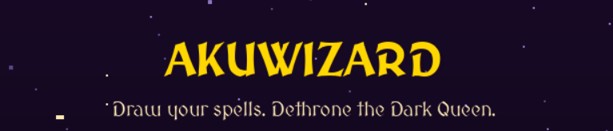
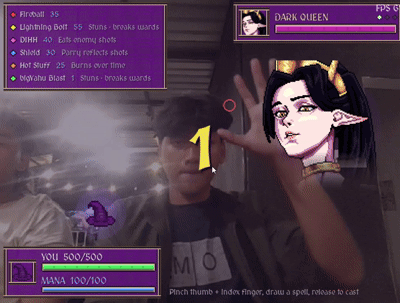
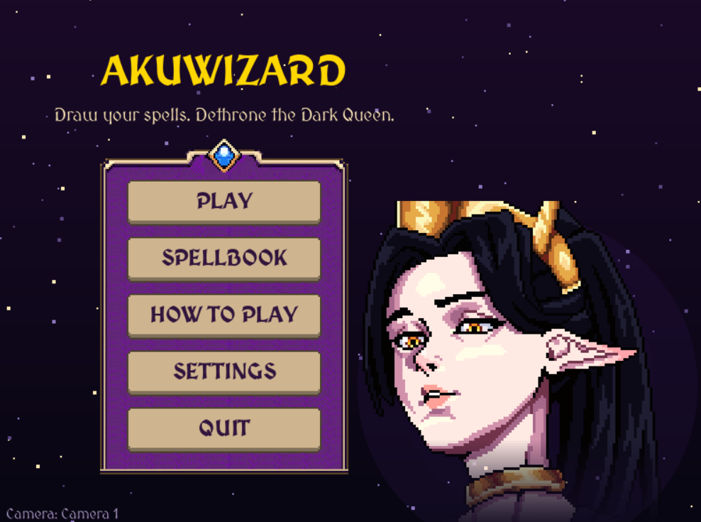
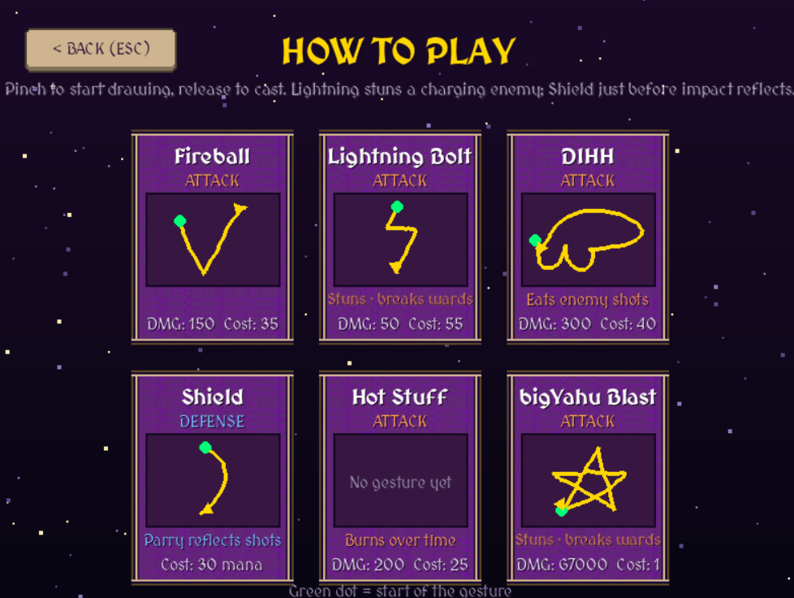
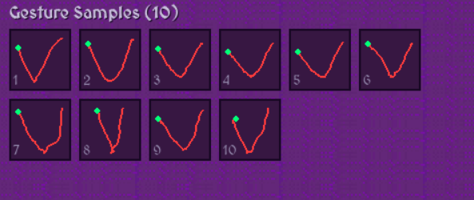
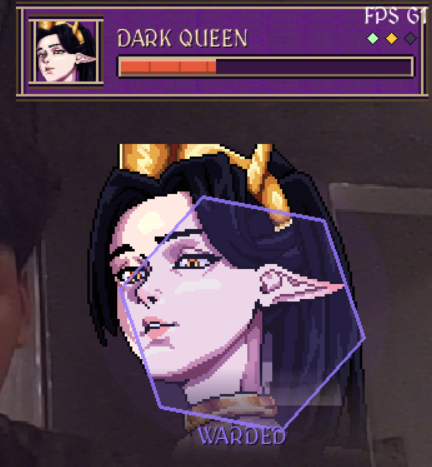
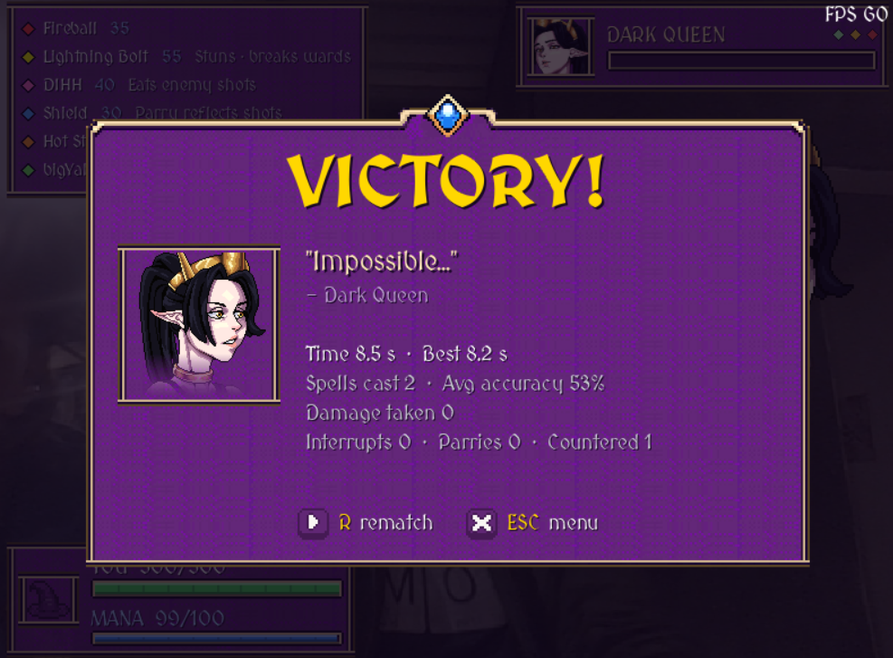
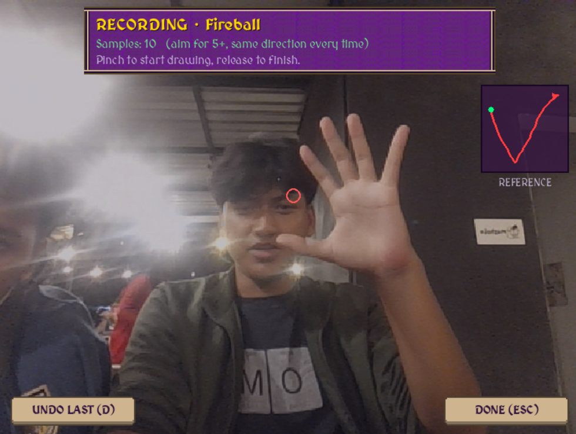

<p align="center">
  <!-- IMAGE: Assets/banner.png — game logo / title art, about 1280x400 -->
  
</p>


<p align="center">
  A 2D boss-fight game where you cast spells by drawing gestures in the air with your hand, tracked live through a webcam.
</p>

<p align="center">
  
  
  
  
  
</p>

---

## Table of Contents

- [About](#about)
- [Gameplay](#gameplay)
- [Features](#features)
- [Spellbook](#spellbook)
- [The Dark Queen](#the-dark-queen)
- [Controls](#controls)
- [Getting Started](#getting-started)
- [Recording Your Own Spells](#recording-your-own-spells)
- [Building a Standalone Executable](#building-a-standalone-executable)
- [How It Works](#how-it-works)
- [Project Structure](#project-structure)
- [Customization](#customization)
- [Troubleshooting](#troubleshooting)
- [Tech Stack](#tech-stack)
- [Credits](#credits)
- [Author](#author)

---

## About

**akuWizard** (formerly *War of Wizards*) turns your webcam into a wand. There is no keyboard or mouse in combat: you pinch your thumb and index finger together, trace a sigil in the air, and release to cast. The game recognizes the shape you drew, scores how accurately you drew it, and fires the matching spell at the Dark Queen.

The project combines real-time hand tracking (MediaPipe), gesture recognition (the $P point-cloud recognizer), and a pygame-based combat system with phases, counters, parries, and enemy wards.

<p align="center">
  <!-- IMAGE: Assets/gameplay.gif — 5 to 10 second clip of drawing a spell and hitting the queen. A GIF works best here. -->
  
</p>

---

## Gameplay

1. Raise your hand in front of the camera to begin. A three-second countdown starts the fight.
2. **Pinch** your thumb and index finger to start drawing. A glowing trail follows your fingertips.
3. Trace the gesture for the spell you want.
4. **Release** the pinch to cast. If the shape matches a known spell closely enough and you have the mana, the spell fires.
5. Reduce the Dark Queen's HP to zero before she does the same to you.

Accuracy matters. Damage is scaled by how closely your drawing matches the recorded gesture, and drawing the sigil larger gives a small bonus (up to 1.3x). A sloppy or ambiguous drawing fizzles instead of casting.

<p align="center">
  <!-- IMAGE: Assets/screenshot_battle.png — mid-fight screenshot showing HUD, spell list, boss bar -->
  
  &nbsp;
  <!-- IMAGE: Assets/screenshot_howto.png — the HOW TO PLAY screen with spell cards -->
  
</p>

---

## Features

- **Hand-gesture casting.** Spells are drawn in the air and recognized from a live webcam feed; no controller required.
- **Accuracy-based damage.** Every cast reports its match percentage, size multiplier, and final damage.
- **Tactical spell effects.** Burn over time, instant interrupts that stun a charging enemy, slow counter orbs that eat incoming shots, and a shield that reflects attacks when timed perfectly.
- **Three-phase boss fight.** The Dark Queen speeds up, raises wards, and switches to rapid volleys as her HP drops.
- **Custom spells.** Record new gestures with your own hand and tune damage, mana cost, color, and effect.
- **Recognition tester.** A leave-one-out test script shows which recorded samples are confused with other spells.
- **Camera picker.** Lists every connected webcam with a live preview and hand-skeleton overlay so you can confirm tracking works before playing.
- **Smooth input.** One Euro filtering, pinch hysteresis, and jump rejection keep strokes clean even on noisy webcams.
- **Stable frame rate.** Camera capture and hand detection run on a background thread, so the game renders at 60 FPS even with a 30 FPS webcam.
- **Resizable window.** The arena letterboxes to the camera's aspect ratio so gestures are never stretched.
- **Personal best tracking.** Your fastest winning time is saved between sessions.
- **Graceful asset fallback.** Missing sprites, sounds, or fonts never crash the game; shape-drawn visuals and silent playback are used instead.
- **Distributable build.** A PyInstaller spec produces a single Windows executable.

---

## Spellbook

The default `spells.json` ships with the following spells:

| Spell | Type | Base Damage | Mana Cost | Effect |
|---|---|---:|---:|---|
| **Fireball** | Attack | 150 | 25 | **Burn**: deals an extra 40% of the hit as damage over 3 seconds |
| **Lightning Bolt** | Attack | 250 | 55 | **Interrupt**: instant hit, stuns a charging enemy for 1.4 s, shatters wards |
| **DIHH** | Attack | 100 | 20 | **Counter**: slow, large orb that destroys enemy projectiles in its path |
| **Shield** | Defense | – | 15 | **Parry**: blocks for 1.5 s; cast within 0.35 s of impact to reflect the shot at 2x damage |

<p align="center">
  <!-- IMAGE: Assets/spell_gestures.png — the gesture shapes for each spell (e.g. a crop of the HOW TO PLAY cards) -->
  
</p>

The green dot on each card in the in-game **HOW TO PLAY** screen marks where the gesture starts, and the arrow shows the direction to draw.

**Player stats:** 500 HP, 100 mana, regenerating 12 mana per second.

---

## The Dark Queen

The boss has 1000 HP and fights in three phases:

| Phase | Enemy HP | Behavior |
|---|---|---|
| **I** | above 50% | Slow, telegraphed heavy shots. Plenty of time to react. |
| **II** | 25% – 50% | Faster attacks with shorter wind-ups. Begins raising **wards** that block every spell except interrupts. |
| **III** | below 25% | Rapid three-shot volleys with very short telegraphs. Wards appear more often. |

Watch for the **CHARGING** tag under the queen: that is your window to interrupt her with Lightning Bolt. When a violet hexagon ward appears, only an interrupt spell can break it.

<p align="center">
  <!-- IMAGE: Assets/screenshot_phases.png — the queen charging, warded, or in phase III -->
  
</p>

At the end of each fight a summary screen shows your time, spells cast, average accuracy, damage taken, and the number of interrupts, parries, and counters.

<p align="center">
  <!-- IMAGE: Assets/screenshot_victory.png — the VICTORY or DEFEAT summary screen -->
  
</p>

---

## Controls

### In battle

| Input | Action |
|---|---|
| Pinch thumb + index finger | Start drawing a spell |
| Move hand while pinching | Draw the gesture |
| Release the pinch | Cast the spell |
| `P` | Pause / resume |
| `R` | Rematch (on the end screen) |
| `F3` | Toggle FPS counter |
| `Esc` | Return to the main menu |

If your hand leaves the camera while drawing, the stroke is cancelled rather than cast, so a half-drawn spell never fires by accident.

### Main menu

| Button | Description |
|---|---|
| **PLAY** | Start the fight |
| **HOW TO PLAY** | View every spell with its gesture, cost, and effect |
| **CAMERA** | Choose which webcam to use, with a live hand-tracking preview |
| **QUIT** | Exit the game |

---

## Getting Started

### Requirements

- Python **3.10 – 3.12** (MediaPipe wheels may not yet be available for the newest Python release)
- A webcam
- Reasonable, even lighting so your hand is clearly visible

### 1. Clone the repository

```bash
git clone https://github.com/niko051207/akuWizard.git
cd akuWizard
```

### 2. Create a virtual environment (recommended)

```bash
python -m venv .venv

# Windows
.venv\Scripts\activate

# Linux / macOS
source .venv/bin/activate
```

### 3. Install dependencies

```bash
pip install -r requirements.txt
```

Optional, Windows only: install `pygrabber` to show real camera names in the camera picker instead of "Camera 1", "Camera 2".

```bash
pip install pygrabber
```

### 4. Download the hand tracking model

The game uses MediaPipe's Hand Landmarker model. Download `hand_landmarker.task` and place it in the project root, next to `main.py`:

```bash
# Linux / macOS
curl -L -o hand_landmarker.task https://storage.googleapis.com/mediapipe-models/hand_landmarker/hand_landmarker/float16/latest/hand_landmarker.task
```

On Windows, the 'hand_landmarker.task' aready included in the 'main' folder.

### 5. Run the game

```bash
python main.py
```

---

## Recording Your Own Spells

Spells are stored in `spells.json` as a set of recorded gesture samples. Use the recorder to add new spells or improve existing ones. It uses exactly the same input pipeline as the game, so recordings match how spells are cast.

```bash
# Record samples for an existing or new spell
python record_spells.py Fireball

# Create a spell with custom stats
python record_spells.py Frostbite --damage 90 --cost 20 --effect counter --color 120,200,255

# Create a defensive spell
python record_spells.py Barrier --type defense --cost 15

# Use a specific webcam (1 = first camera)
python record_spells.py Fireball --camera 2
```

| Option | Description |
|---|---|
| `name` | Spell name. If omitted, the recorder asks for it. |
| `--damage` | Base damage of the spell |
| `--cost` | Mana cost |
| `--type` | `attack` or `defense` |
| `--effect` | `none`, `burn`, `interrupt`, or `counter` |
| `--color` | Projectile color as `R,G,B` |
| `--camera` | Camera number to use; defaults to the one chosen in the game's CAMERA menu |

**Recorder controls:** pinch and release to draw a stroke, `Enter`/`Space` to save it as a sample, `Backspace`/`R` to discard and redraw, `D` to delete the last saved sample, `Esc` to quit.

Record **8 to 12 samples** per spell, varying size and speed slightly, for reliable recognition.

<p align="center">
  <!-- IMAGE: Assets/screenshot_recorder.png — record_spells.py window with a saved stroke in green -->
  
</p>

### Testing recognition quality

After recording, check how well your spells can be told apart:

```bash
python test_spells.py
```

Each sample is matched against all the others (leave-one-out) using the same thresholds as the game. The report lists any sample recognized as the wrong spell, plus the median confidence margin per spell. Re-record or delete samples that cause confusion.

---

## Building a Standalone Executable

The repository includes a PyInstaller spec that bundles the model, default spells, and all assets into a single windowed executable.

```bash
pip install pyinstaller
pyinstaller main.spec
```

The output is written to `dist/WarOfWizards.exe`. Make sure `hand_landmarker.task` is in the project root before building.

When running from the executable, writable data (recorded spells, settings, best time) is stored in `%APPDATA%\WarOfWizards` so it survives restarts. When running from source, these files stay next to the code.

To see `print()` output while debugging a build, set `console=True` in `main.spec`.

---

## How It Works

```
Webcam ──> OpenCV capture ──> MediaPipe Hand Landmarker ──> 21 hand landmarks
                    (background thread)                            │
                                                                   v
                                      Pinch detection (thumb tip ↔ index tip)
                                                                   │
                                                                   v
                                  One Euro filter + jump rejection ──> stroke
                                                                   │
                                                                   v
                              $P point-cloud recognizer vs. spells.json templates
                                                                   │
                                                                   v
                            Accuracy + margin check ──> mana check ──> cast spell
```

**Hand tracking.** `HandTracker` reads the webcam and runs MediaPipe on its own thread. The game loop only ever reads the latest result, so rendering never waits on the camera.

**Pinch detection.** The distance between the thumb tip and index fingertip is divided by the hand's size (wrist to middle knuckle), so the same pinch works whether you stand close to the camera or far from it. Separate on and off thresholds plus a two-frame confirmation prevent flicker.

**Stroke smoothing.** Each point passes through a One Euro filter, which smooths heavily when the hand moves slowly and follows closely when it moves fast. Single-frame tracking glitches are rejected, and the last few points are trimmed on release because opening the fingers tends to drag the cursor.

**Recognition.** Strokes are resampled to 32 points and compared against every recorded template with the $P point-cloud recognizer, which is independent of stroke direction and order. A cast succeeds only if the best match scores at least **50%** and beats the next-best *different* spell by at least **10%**, which filters out ambiguous drawings.

**Damage.** `damage = base_damage × match_score × size_multiplier`, where the size multiplier ranges from 0.7 to 1.3 based on the stroke's diagonal relative to the arena height.

---

## Project Structure

```
akuWizard/
├── main.py              # Entry point: window, main menu, HOW TO PLAY screen
├── game.py              # Combat simulation, boss AI, rendering, HUD, end screen
├── hand_input.py        # Webcam thread, MediaPipe, pinch state machine, stroke smoothing
├── spell_recognizer.py  # spells.json loading/saving, spell effects, $P recognizer
├── record_spells.py     # CLI tool to record gesture samples for spells
├── test_spells.py       # Leave-one-out recognition quality report
├── camera_select.py     # CAMERA screen with live preview and hand skeleton
├── sprites.py           # Sprite and animation loader with fallbacks
├── ui_kit.py            # Pixel-art UI panels, buttons, bars, text rendering
├── sounds.py            # Sound effect and music playback (missing files are skipped)
├── fonts.py             # Font loading with default-font fallback
├── settings.py          # Persistent player settings (selected camera)
├── paths.py             # Resource vs. user-data paths for source and PyInstaller builds
├── spells.json          # Spell definitions and recorded gestures
├── main.spec            # PyInstaller build configuration
├── requirements.txt
├── hand_landmarker.task # MediaPipe model (download separately, see Getting Started)
├── assets/
│   ├── *.ttf            # MedievalSharp fonts
│   ├── sprites/         # Character and projectile sprites, optional sprites.json
│   ├── sfx/             # Sound effects
│   └── music/           # Background music
└── docs/
    └── images/          # Screenshots and GIFs used in this README
```

---

## Customization

### Sprites

Drop PNG files into `assets/sprites/` and the game picks them up automatically. Anything missing falls back to shape-drawn visuals, so sprites can be added one at a time.

| Sprite name | Used for |
|---|---|
| `enemy_idle` | The Dark Queen standing (required for the enemy to use sprites) |
| `enemy_charge`, `enemy_stunned`, `enemy_hurt`, `enemy_dead`, `enemy_taunt`, `enemy_talk` | Enemy states |
| `player_idle`, `player_cast`, `player_hurt`, `player_dead` | Player states |
| `proj_player`, `proj_enemy` | Default projectiles |
| `proj_<spell>` | Per-spell projectile, e.g. `proj_fireball.png` |

Each sprite can be a single image, a horizontal sprite strip, or a folder of numbered frames. An optional `assets/sprites/sprites.json` controls frame count, FPS, looping, flipping, tinting, scaling, and placement. See the docstring at the top of `sprites.py` for every option.

### Sounds

Place audio files in `assets/sfx/` and `assets/music/` (`.wav`, `.ogg`, or `.mp3`). The game looks for these names:

- **Effects:** `cast`, `fail`, `shield_cast`, `shield_block`, `hit_enemy`, `hit_player`, `victory`, `defeat`
- **Music:** `battle_theme`

### Balancing

Combat tuning constants (HP, mana regeneration, recognition thresholds, phase timings, effect durations) are grouped at the top of `game.py`. Per-spell damage, cost, color, type, and effect can be edited directly in `spells.json`.

---

## Troubleshooting

| Problem | Solution |
|---|---|
| "The camera isn't working" | Close other apps using the webcam (Zoom, Teams, browser tabs), or pick another camera from **CAMERA** in the main menu. |
| "Couldn't load hand_landmarker.task" | Download the model (see [Getting Started](#4-download-the-hand-tracking-model)) and place it next to `main.py`. |
| Spells keep fizzling | Draw larger and more deliberately, start at the green dot shown in HOW TO PLAY, and record more samples of that spell. Run `test_spells.py` to find confusing samples. |
| "Looked like two spells at once" | Two of your spells have similar shapes. Re-record one with a more distinct gesture. |
| Hand not detected or cursor is jittery | Improve lighting, avoid a busy background, and keep your whole hand in frame. |
| `pip install mediapipe` fails | Use Python 3.10 – 3.12. |
| No sound | Make sure the audio files exist in `assets/sfx/` and `assets/music/` with the names listed above. |

---

## Tech Stack

| Library | Purpose |
|---|---|
| [pygame-ce](https://github.com/pygame-community/pygame-ce) | Rendering, input, audio |
| [MediaPipe](https://developers.google.com/mediapipe) | Real-time hand landmark detection |
| [OpenCV](https://opencv.org/) | Webcam capture and frame processing |
| [dollarpy](https://pypi.org/project/dollarpy/) | $P point-cloud gesture recognizer |
| [NumPy](https://numpy.org/) | Array handling |
| [PyInstaller](https://pyinstaller.org/) | Standalone executable builds |

---

## Credits


### Core Technologies & Libraries
- **Gesture Recognition:** [$P Point-Cloud Recognizer](https://depts.washington.edu/madlab/proj/dollar/pdollar.html) by Radu-Daniel Vatavu, Lisa Anthony, and Jacob O. Wobbrock (ICMI 2012)
- **Hand Tracking Model:** [MediaPipe Hand Landmarker](https://developers.google.com/mediapipe/solutions/vision/hand_landmarker) by Google
- **Typography:** [MedievalSharp Font](https://fonts.google.com/specimen/MedievalSharp) by Google Fonts

### Visual & UI Assets
- **UI Kit:** [MagicUI]((https://toffeecraft.itch.io/ui-user-interface-pack-magic)) by ToffeeCraft
- **Dark Queen Sprites & Portraits:** [FREE DARK ELF QUEEN AVATAR ICON PIXEL PACK FOR DIALOGUE](https://craftpix.net/freebies/free-dark-elf-queen-avatar-icon-pixel-pack-for-dialogue/) by CraftPix.net

### Audio & Music
- **Music:**
  - *"Battle Epic"* by Kulakovka via [Pixabay]((https://pixabay.com/music/main-title-battle-epic-274997/))
- **Sound Effects:**
  - *"20 Sword Sound Effects (Attacks And Clashes)"* by StarNinjas via [OpenGameArt.org](https://opengameart.org/content/20-sword-sound-effects-attacks-and-clashes)
  - *"Magic spell cast whoosh delay"* by ryusa via [Freesound.org](https://freesound.org/people/ryusa/sounds/531081/)
  - *"riot shields testudo"* by Diasyl via [Freesound.org](https://freesound.org/people/Diasyl/sounds/792354/)
  - *"Fanfare 2 - Rpg"* by colorsCrimsonTears via [Freesound.org](https://freesound.org/people/colorsCrimsonTears/sounds/580310/)
  - *"explosion6"* by ReadeOnly via [Freesound.org](https://freesound.org/people/ReadeOnly/sounds/186957/)
  - *"game Over Orchestral Stinger - Cartoon Defeat"* by TommasoMotteran via [Freesound.org](https://freesound.org/people/TommasoMotteran/sounds/856516/)
  - *"Magic Bass Hit"* by 1LOVE via [Freesound.org](https://freesound.org/people/1LOVE/sounds/711187/)
  - *"8-bit damage sound"* by EVRetro via [Freesound.org](https://freesound.org/people/EVRetro/sounds/501104/)

### AI Assistance
- **Code Assistance & Development Support:** Anthropic Claude, Google Gemini, and OpenAI ChatGPT

---

---

## Author

**Nicholaus Ardian Nugraha**
Informatics Engineering, Institut Teknologi Sepuluh Nopember (ITS)

<!-- EDIT: add your GitHub / LinkedIn links -->
GitHub: [@niko051207](https://github.com/niko051207)
